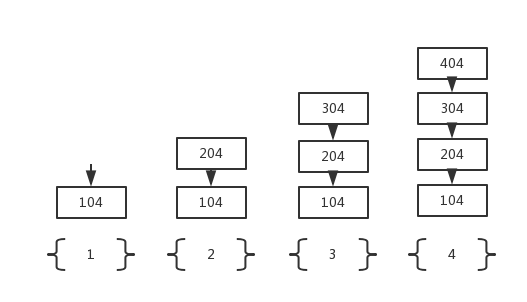

# 是否可以资源不动而切换指令序列？
进程 = 资源 + 指令执行序列

进程在切换的时候，不仅是指令的切换，映射表上资源（内存）也会跟着切换，代价大。
- 将资源和和指令执行分开
- 一个资源 + 多个指令执行序列
线程：保留了并发的优点，避免了进程切换的代价（只切换指令，不切换映射表）。

# 多个执行序列+一个地址空间是否实用？
一个网页浏览器，先加载出文本，再慢慢加载完图片。
- 一个线程用来从服务器接收数据
- 一个线程用来显示文本
- 一个线程用来处理图片（如解压缩）
- 一个线程用来显示图片
这些线程要共享资源吗？
- 接收数据放在100处，显示时要读...
- 所有的文本、图片都显示在一个屏幕上。

想，只有一个CPU在工作，可以切换到不同的进程，进程内还有不同的线程，还要更细的切换，即一个CPU在无数个线程中切换执行。比如遇到一个线程用来从服务器接收数据，这个时间会很长，CPU就切出去，做其他线程，不会干等着。

# 开始实现这个浏览器...
```
void WebExplorer() {
    char URL[] = "http://cms.hit.edu.cn";
    char buffer[1000];
    //创建获取数据进程
    pthread_create(..., GetData, URL, buffer);
    //创建展示数据进程
    pthread_create(..., Show, buffer);
}
```
```
void GetData(char *URL, char *p) {
    ...
}
```
```
void Show(char *p) {
    ...
}
```

（看过去和顺序执行一样...

# Create? Yield?
核心是Yield...
- 能切换了就知道切换时需要是个什么样子
- Create就是要制造出第一次切换时应该的样子
  
# 两个执行序列和一个栈...


第一个Yield函数
```
void Yield() {
    找到 300;
    jump 300;
}
```
第二个Yield函数
```
void Yield() {
    找到 204;
    jump 204;
}
```


1. 执行第一个序列，执行A()，中调用B()，先将以后要返回继续执行的地址104压入栈
2. 在B()中，又调用了Yield(),以后要返回继续执行的地址204压入栈
3. 因为Yield(), 跳到300，继续执行C()，中调用D(), 先将以后要返回继续执行的地址304压入栈
4. 执行D(),中调用Yield()，先把404压栈，再跳到204
5. 继续执行完B()，碰到最后的`}`,被译为一条汇编指令Ret，要弹栈，把栈顶的404弹出？没调用Yield(), 自动回到了线程2？所以两个执行序列一个栈是错误的...

*这是一个线程内的函数调用，跳回了204，本应该继续执行，跳回104，而不应该跳到另一个线程！*
*为什么会出现这种错误呢？因为两个线程共用了一个栈！*


# 从一个栈到两个栈...

- Yield切换要先切换栈，然后...
```
//第二个yield
void Yield() {
    //esp是CPU的寄存器
    TCB2.esp = esp;         //保存下当前的esp
    esp = TCB1.esp;         //把当前的esp切换到TCB1的
    jump 204;               //跳回204
}
```
*但是又会遇到一个问题，调用第二个Yield()后（因为jump，所以没执行Yield()中的`}`,所以204并没有弹栈），到B()中继续执行，遇到`}`，又Ret，弹栈，此时栈顶还是204，又执行204？*

解决办法，去掉`jump 204`，已经切换了栈，就让Yield()执行到最后，让`}`弹栈204，自动跳到204。
```
void Yield() {
    //esp是CPU的寄存器
    TCB2.esp = esp;
    esp = TCB1.esp;       
}
```

# 两个线程的样子：两个TCB、两个栈、切换的PC在栈中
ThreadCreate的核心就是用程序作出这三样东西

```
void ThreadCreate() {
    TCB *tcb = malloc();     //为TCB申请内存空间
    *stack = malloc();      //为栈申请内存空间
    *stack = A;             //指向该线程的初始地址100
    tcb.esp = stack;          //tcb.esp指向该栈，关联起来
}
```

# 为什么说是用户级线程---Yield是用户程序


进程1中的线程1: GetData
```
连接URL发起请求;
等待网卡IO;
进程阻塞...
```
进程1中的线程2: Show
```
显示文本和链接；
```

缺点：线程完全是在用户态切来切去，操作系统完全感知不到它的存在。例如线程1访问网卡IO，肯定要进入计算机硬件，肯定要进内核，网卡比较慢，所以阻塞了。进程1一阻塞了，内核就要切换到其他进程（内核看不到进程1有别的线程）。

# 核心级线程

