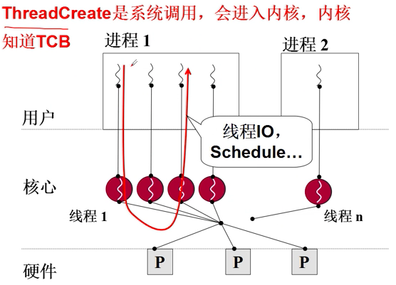

# 开始核心级线程
- 为什么没有用户级进程呢？
- 因为进程要分配资源，访问内存，这是用户态所不能的。


- CPU：中央处理器
- Cache：缓存区
- MMU：映射表

我们使用的计算机大多数是多核，多个处理器，共用一套映射表和缓存区。（一个进程对应一个映射表）如果是多进程，那就要切换映射表。如果只是用户级线程，就会出现L10末尾所提到的问题。但是使用核心级线程，就不需切换映射表，只需切换指令即可。
多进程不能发挥多核的价值，用户级线程也不能发挥多核的价值。

# 和核心级线程相比，核心级线程有什么不同？

ThreadCreate是系统调用，内核管理TCB，内核负责切换线程。

如何让切换成型？---内核栈，TCB
- 用户栈是否还要用？执行的代码仍然在用户态，还要进行函数调用。
- 一个栈到一套栈，两个栈(用户级)到两套栈（核心级）
- TCB关联内核栈，那用户栈怎么办？在用户级线程中，TCB切换，根据TCB切换用户栈。而在核心级线程中，TCB切换，切换一套栈（内核栈和用户栈）。


# 用户栈和内核栈之间的关联

- SS寄存器: 栈顶的段地址
- SS寄存器: 栈顶的偏移地址
- EFLAGS:
- 源PC: 执行到的指令
- 源CS: 段基址

# 仍然是那个A(), B(), C(), D()...


# 开始内核中的切换: switch_to

```
sys_read() {
    启动磁盘读;
    将自己变成阻塞;
    找到next;
    switch_to(cur, next);
}
```
switch_to: 
- 仍然是通过TCB找到内核栈指针;
- 然后通过ret切到某个内核程序; 
- 最后再用CS:PC切换到用户程序

????

一段能完成第二级返回的代码，一段包含iret的代码...

# 内核线程switch_to的五段论


1. 中断入口：（进入切换）
```
push ds; ... pusha;
mov ds, 内核段号; ...
call 中断处理
```
2. 中断处理：（引发切换）
```
启动磁盘读或时钟中断;
schedule();
} //ret
```
3. schedule:
```
next=..;
call switch_to;
} //ret
```
4. switch_to：（内核栈切换）（第一级切换）
```
TCB[cur].esp = %esp;
%esp=TCB[next].esp;
ret
```
5. 中断出口：（第二级切换）
```
popa;...; pop ds;
iret
```
6. T非同一进程：（地址切换）
```
要首先切换地址映射表;
TCB[cur].ldtr=%ldtr
%ldtr=TC[next].ldtr
//内存管理
```
# 用户级线程、核心级线程的对比

