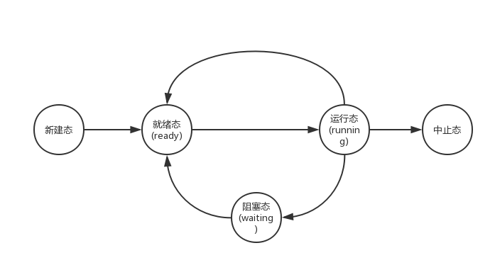

# 多个进程使用CPU的图像
- 如何使用CPU呢？
    - 让程序执行起来
- 如何充分利用CPU呢？
    - 启动多个程序，交替执行
- 启动了的程序就是进程，所以是多个进程推进
    - 操作系统只需要把这些进程记录好、要按照合理的次序推进（分配资源、进行调度）
    - 这就是多进程图像

# 多进程图像从启动开始到关机结束
- 开机时，（main中的fork()）创建了第一个进程（在linux就是shell，在windows就是桌面）。
- shell再启动其他进程。

# 多进程图像：多进程如何组织？
PCB：Process Control Block，用来记录进程信息的数据结构。
- 有一个进程在执行
- 有一些进程等待执行（就绪队列）
- 有一些进程在等待某事件（磁盘等待队列）

好比生活中，银行排队。正在窗口办理业务的是运行态（running）。在后边排队的是就绪态（ready）。到窗口运行了，忽然发现没带身份证，这就麻烦了呀，回去拿，进入阻塞态（waiting），再重新进入就绪态，重新排队。

# 多进程图像：多进程如何交替？
伪代码
```
启动磁盘读写;
pCur.state = 'W';          //将当前正在执行的进行的进程状态赋值为阻塞(waiting)状态。
将pCur放到DiskWaitQueue;    //放入阻塞队列
schedule();                //切换进程
```
```
schedule() {
    pNew = getNext(ReadyQueue);     //从就绪队列中获得下个运行的进程，选取哪一个又是一个问题，最简单就是取队头
    switch_to(pCur, pNew);          //切换
}
```

# 交替的三个部分：队列操作+调度+切换
就是进程调度，一个很深刻的话题。
- 调度：就是找到下一个进程。调度的方式有很多。例如FIFO、Priority。
- 切换：就是切换到刚刚找到的进程。（切换前，将物理CPU内的一段数据存入PCB1；切换后，将PCB2中的数据放入物理CPU）

比如你之前在看一本书，之前预约的客人来敲门了。你记住书的页码记住，开门，将对客人的样子、往事想起，和客人聊天。将客人送走后，继续从离开前的书页往后看。
```
switch_to(pCur, pNew) {
    //切换前，将物理CPU内的一段数据存入pCur
    pCur.ax = CPU.ax;          
    pCur.bx = CPU.bx;
    ...
    pCur.cs = CPU.cs;
    pCur.retpc = CPU.pc;

    //切换后，将pNew中的数据放入物理CPU
    CPU.ax = pNew.ax;
    CPU.bx = pNew.bx;
    ...
    CPU.cs = pNew.cs;
    CPU.retpc = pNew.pc;
}
```

# 多进程图像：多进程如何影响？
多个进程同时存在于内存会出现下面的问题

进程1代码
```
mov ax, 10100b
mov [100], ax       //对地址100进行了赋值！
```
进程2代码
```
100: 00101         //同时对地址100进行操作！
```
- 解决办法：限制对地址100的读写
- 多进程的地址空间分离：内存管理的主要内容

# 进程执行时的100...
通过映射表，可以随便填写，即使填写相同的地址，也会被映射到不同的地址。
- 100->进程1映射表->780
- 100->进程2映射表->1260


# 多进程图像：多进程如何合作？
打印机工作过程，例如先打印一个word，再打印一个pdf，按着顺序来。如果中间出现进程切换，那就word里面混着pdf。

# 从纸上到实际：生产者-消费者实例
共享数据
```
#define BUFFER_SIZE 10
typedef struct {
    ...
} item;
int in = out = count = 0;
```

生产者进程
```
while(true) {
    while(counter == BUFFER_SIZE);      //当缓冲区满了的时候，就等在这，不再向下执行
    buffer[in] = item;
    in = (in + 1) % BUFFER_SIZE;
    count ++;
}
```
消费者进程
```
while(true) {
    while(count == 0);                  //当缓冲区为空时，等待进货。
    item = buffer[out];
    out = (out + 1) % BUFFER_SIZE;
    counter --;
}
```

# 两个合作的进程都要修改counter
贡献数据
```
int counter = 0;
```
生产者进程
```
counter ++;
```
消费者进程
```
count --;
```
生产者P
```
register = counter;         //编译后，先赋值给寄存器
register = register + 1;    //寄存器+1
counter = register;         
```
消费者C
```
register = counter;
register = register - 1;
counter = register;
```
因为进程间可切换，一个可能的执行序列如下:
```
//在P进程中
P.register = counter;               //P.register = counter = 0
P.register = P.register + 1;        //P.register = 1
//切换到C进程中
C.register = counter;               //C.register = counter = 0
C.register = C.register - 1;        //C.register = -1
//再切换到P
counter = P.register;               //counter = P.register = 1
//再切换到C
counter = C.register;               //counter = C.register = -1
```
如上所述，最后的counter语义可能会错误。

# 核心在于进程同步（合理的推进顺序）
写counter时阻断其他进程访问counter，即合理切换，而不是任意切换！

再参看上述的可能执行序列，给出锁以后：

```
//生产者P
/*给counter上锁*/
P.register = counter;               //P.register = counter = 0
P.register = P.register + 1;        //P.register = 1

//消费者C
/*检查counter锁*/
//想执行如下2行代码，发现无法执行，counter还在上锁，无法切换进程
//C.register = counter;            
//C.register = C.register - 1;  

//生产者P
counter = P.register;               //counter = P.register = 1;
/*给counter开锁*/

//消费者C
C.register = counter;               //C.register = counter = 1;
C.register = C.register - 1;        //C.register = 0;
counter = C.register;               //counter = C.register = 0;
```

# 如何形成多进程图像？
- 读写PCB，OS中最重要的结构，贯穿始终
- 要操作寄存器完成切换（L10，L11，L12）
- 要写调度程序（L13，L14）
- 要有进程同步与合作（L16， L17）
- 要有地址映射（L20）

